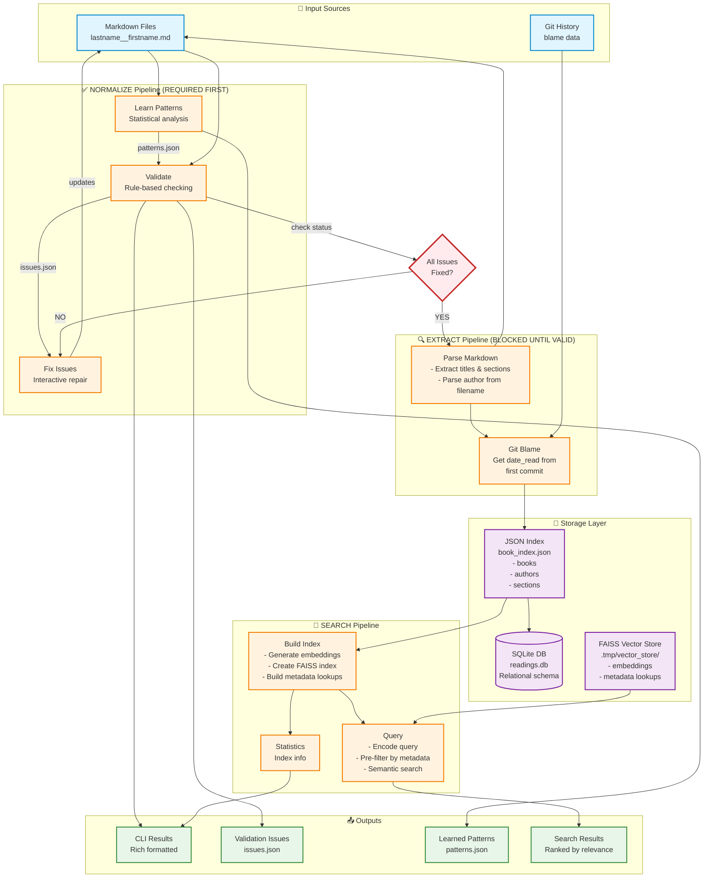
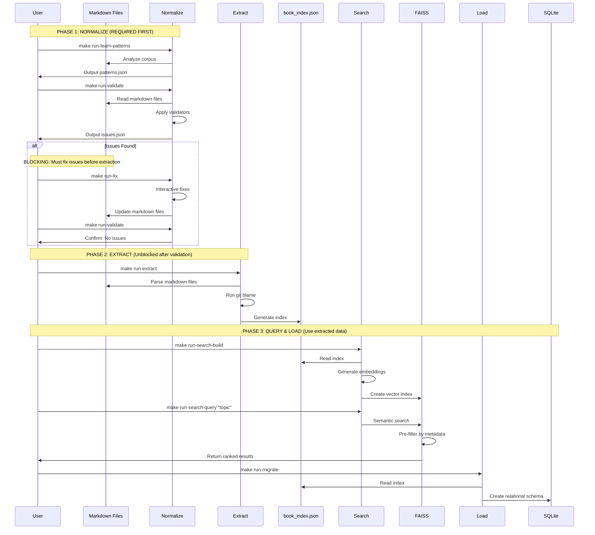
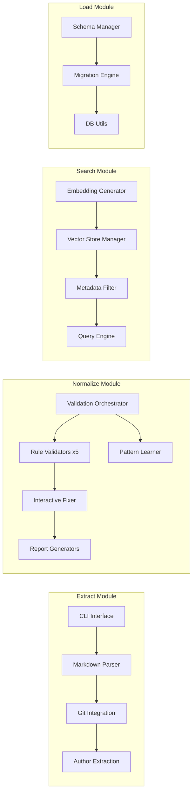
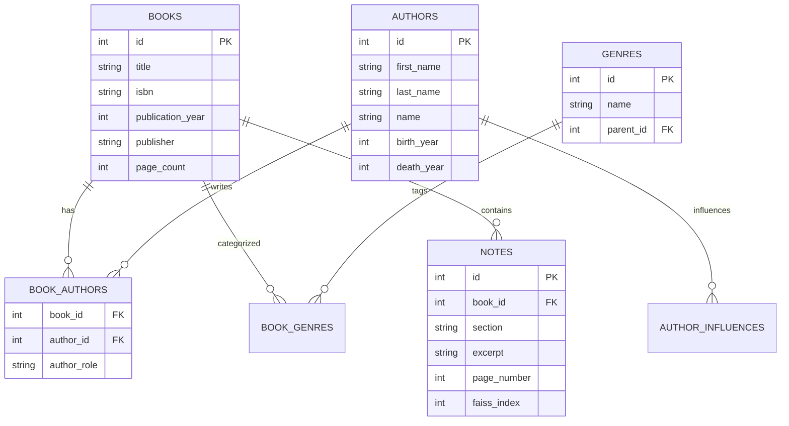
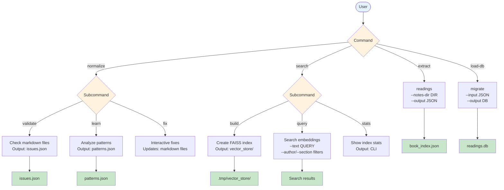

# Git-Reading System Architecture

## Overview

Git-reading is a tool for validating, extracting, querying, and analyzing reading notes stored in markdown files. The workflow is **validation-first**: all markdown files must pass normalization/validation checks before extraction can proceed. This ensures data quality throughout the pipeline.

## System Architecture Diagram

## Data Flow

## Component Responsibilities

## Storage Schema

## CLI Commands

## Key Features

### Validation-First Architecture
- **Blocking validation**: Extraction cannot proceed until all issues are fixed
- **Quality gates**: Ensures data integrity from the start
- **Pattern learning**: Adapts to your corpus's conventions

### Multi-Stage Pipeline
1. **Normalize** (REQUIRED): Validate → Learn patterns → Fix issues
2. **Extract** (BLOCKED): Parse markdown → JSON index
3. **Search**: Build embeddings → Semantic query with pre-filtering
4. **Load**: Migrate to relational database

### Dual Storage Strategy
- **JSON**: Human-readable, version-controllable
- **SQLite**: Relational queries, complex joins
- **FAISS**: High-performance semantic search

### Intelligent Validation
- **Rule-based**: 5 specialized validators
- **Pattern-based**: Learn from corpus statistics
- **Interactive fixing**: User-guided corrections

### Optimized Search
- **Pre-filtering**: Metadata lookups before vector search
- **Multi-field filtering**: Author, section, book
- **Rich metadata**: Date read, source file, chunk context
